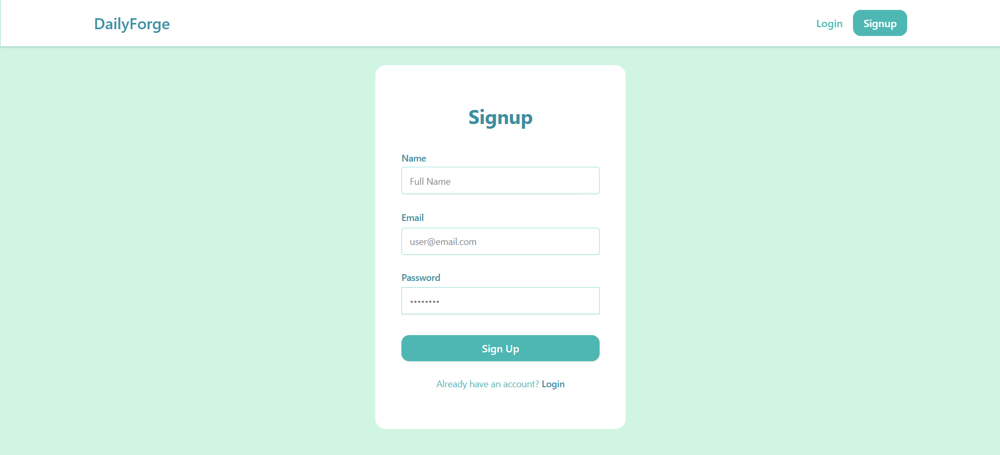
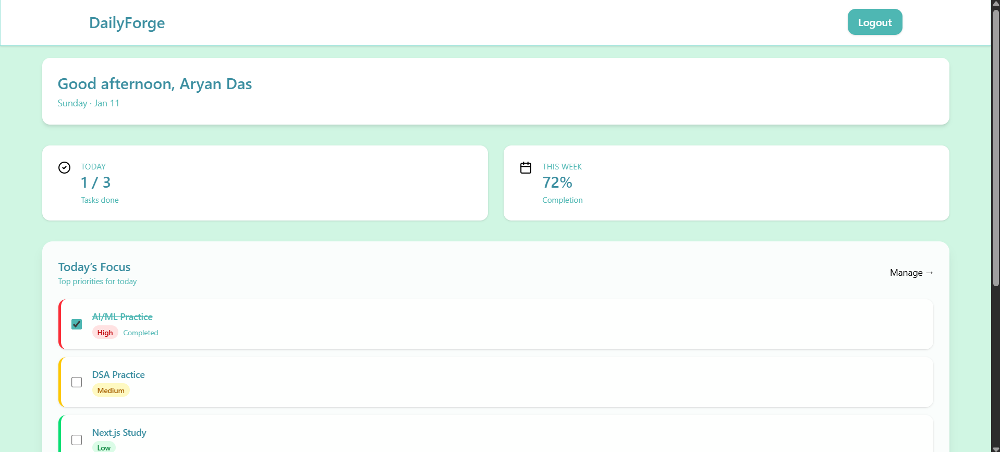
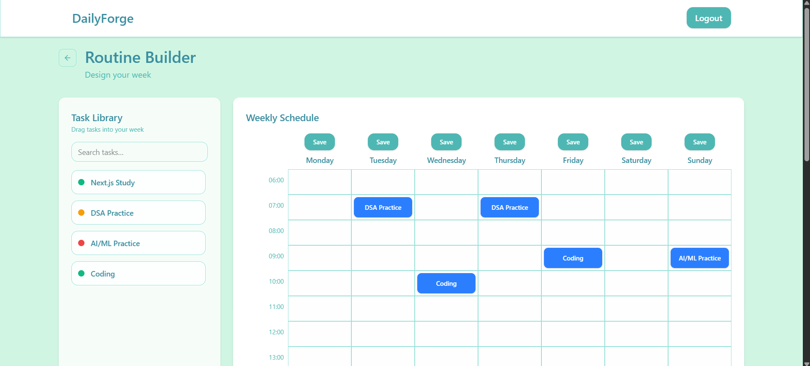

# DailyForge

**DailyForge** is a fullstack MERN app to design and manage your weekly routines. Build routines with drag-and-drop tasks, save them, and visualize your schedule on an interactive dashboard.

**Frontend:** [https://dailyforge-frontend-lhjq.onrender.com](https://dailyforge-frontend-lhjq.onrender.com)  
**Backend:** [https://dailyforge-backend.onrender.com](https://dailyforge-backend.onrender.com)

---

## Features

- User Authentication (Signup/Login) with JWT  
- CRUD operations for Tasks  
- CRUD operations for Routines  
- Weekly planner with drag-and-drop task placement  
- Routine templates for quick reuse  
- Interactive dashboard to view routines and tasks  
- Overlap protection for tasks in the same day  

---

## Tech Stack

**Frontend:**  
- React  
- Tailwind CSS  
- Context API  
- Axios  

**Backend:**  
- Node.js  
- Express.js  
- MongoDB (Atlas)  
- Mongoose ODM  
- JWT for authentication  
- Bcrypt for password hashing  

---

## Folder Structure

```bash
  backend/
  ├─ controllers/
  │ ├─ authController.js
  │ ├─ routineController.js
  │ ├─ taskController.js
  ├─ models/
  │ ├─ User.model.js
  │ ├─ Task.model.js
  │ ├─ Routine.model.js
  ├─ routes/
  │ ├─ authRoutes.js
  │ ├─ taskRoutes.js
  │ ├─ routineRoutes.js
  ├─ middlewares/
  │ └─ authMiddleware.js
  └─ server.js
  
  frontend/
  ├─ components/
  │ ├─ Dashboard/
  │ ├─ RoutineBuilder/
  │ ├─ TaskLibrary/
  ├─ context/
  │ └─ AuthContext.jsx
  ├─ hooks/
  │ └─ useTasks.js
  ├─ pages/
  │ ├─ Dashboard.jsx
  │ ├─ RoutineBuilder.jsx
  │ ├─ Tasks.jsx
  │ └─ Auth/
  │ ├─ Login.jsx
  │ └─ Signup.jsx
  ├─ api/
  │ └─ axiosConfig.js
  └─ App.jsx
```

---

## Installation

### **Backend**
```bash
  git clone https://github.com/aryandas2911/DailyForge.git
  cd backend
  npm install
  npm run dev
```

### **Frontend**
```bash
  cd frontend
  npm install
  npm start
```

---

## Usage

1. Signup/Login  
2. Create tasks with title, duration, color, and category  
3. Open Routine Builder to drag and drop tasks into the weekly grid  
4. Save routines and view them in the Dashboard  
5. Update or delete tasks and routines as needed  

---

## Screenshots

### Signup Page: 


### Dashboard Page: 


### Tasks Page: 


### Routine Page: 


---

## Contributing

Contributions are welcome!  

1. Fork the repository  
2. Create a feature branch (`git checkout -b feature-name`)  
3. Commit your changes (`git commit -m 'Add feature'`)  
4. Push to the branch (`git push origin feature-name`)  
5. Open a Pull Request  
